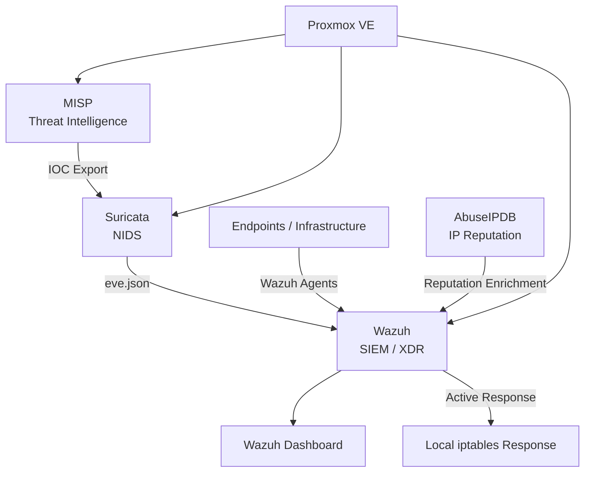

# Cybersecurity Monitoring Lab

A practical **SIEM / IDS / Cyber Threat Intelligence platform** developed during my final Cybersecurity internship project in a real educational environment.

The project combines **Wazuh**, **Suricata**, **MISP**, **AbuseIPDB** and **Proxmox VE** to provide centralized monitoring, network intrusion detection, threat intelligence integration, reputation enrichment and controlled automated response.

## Project Overview

The objective of the project was to design and implement a modular cybersecurity monitoring architecture capable of:

- Centralizing security events
- Monitoring endpoints and infrastructure
- Detecting suspicious network activity
- Correlating Suricata IDS alerts
- Integrating external Cyber Threat Intelligence
- Detecting Indicators of Compromise (IOCs)
- Enriching IP addresses with reputation information
- Executing controlled automated responses
- Managing alert retention
- Providing operational security dashboards

## Architecture

The infrastructure was virtualized using **Proxmox VE**.

Main components:

- **Wazuh** — SIEM/XDR, event collection, correlation and dashboards
- **Suricata** — Network Intrusion Detection System
- **MISP** — Cyber Threat Intelligence and IOC management
- **AbuseIPDB** — IP reputation enrichment
- **Proxmox VE** — Virtualization and service isolation
- **Linux / Ubuntu Server** — Server environment
- **Wazuh Agents** — Endpoint and infrastructure monitoring

Detailed architecture documentation:

[View Architecture Documentation](docs/architecture.md)

## Wazuh

Wazuh operated as the central monitoring and correlation platform.

The implementation included:

- Wazuh Manager
- Wazuh Indexer
- Filebeat
- Wazuh Dashboard
- Endpoint agents
- Custom detection and correlation rules
- Suricata event ingestion
- MISP IOC correlation
- AbuseIPDB enrichment
- Active Response monitoring
- Index State Management retention policies
- Operational dashboards

Custom rule examples are available in:

[Wazuh Detection Rules](wazuh/README.md)

## Suricata

Suricata operated as the dedicated Network Intrusion Detection System.

The implementation included:

- Passive network monitoring
- Emerging Threats rules
- `HOME_NET` and `EXTERNAL_NET` configuration
- Dedicated capture interface
- `eve.json` event generation
- Integration with Wazuh
- Controlled Nmap testing
- False-positive reduction
- IP Reputation integration with MISP

Documentation and sanitized configuration examples:

[Suricata Documentation](suricata/README.md)

## MISP Threat Intelligence

MISP was used as the central Cyber Threat Intelligence platform.

Public CTI feeds were enabled and IOC data was exported automatically through the MISP REST API.

The integration pipeline was:

**MISP → IOC Dataset → Suricata IP Reputation → Wazuh Correlation**

A custom automation script extracted `ip-dst` indicators from MISP and generated datasets consumed by Suricata.

The IOC synchronization process was scheduled to execute automatically every hour.

[MISP Integration Documentation](misp/README.md)

## AbuseIPDB Enrichment

AbuseIPDB was integrated as an additional reputation source.

Observed IP addresses could be enriched with information such as:

- Abuse confidence score
- Number of reports
- Country
- ISP
- Domain
- Tor usage

The enrichment results were written to a log monitored by Wazuh and processed using custom rules.

## Detection Engineering

Custom Wazuh rules were developed for several security scenarios, including:

- Network scans
- Repeated reconnaissance
- Scans against critical services
- Malware-related traffic
- Command and Control activity
- Exploitation attempts
- Phishing
- Suspicious Discord webhook activity
- MISP IOC matches
- Active Response events
- AbuseIPDB enrichment

Several detection rules were also mapped to relevant **MITRE ATT&CK** techniques.

## Active Response

A controlled Wazuh Active Response proof of concept was implemented.

When Suricata detected network communication matching an IOC imported from MISP:

**MISP → Suricata → Wazuh → Active Response → iptables**

The response executed a local script on the Suricata IDS virtual machine and created an `iptables` DROP rule.

This implementation demonstrated automated response capabilities but was intentionally limited to local blocking on the Suricata VM and was not designed as a perimeter firewall for the entire network.

## Automation

Several Bash scripts were developed to automate security operations:

- `update_misp_iocs.sh` — Synchronizes MISP IOC data with Suricata
- `misp_ioc_block.sh` — Performs controlled IOC-based Active Response
- `abuseipdb_check.sh` — Enriches IP addresses using AbuseIPDB

Scripts and documentation:

[Automation Scripts](scripts/README.md)

## Data Retention

An OpenSearch Index State Management policy was configured for `wazuh-alerts-*`.

The policy automatically manages alert indices and removes data older than **30 days**.

## Dashboards

Operational dashboards were created for:

- Infrastructure monitoring
- Suricata IDS
- Threat Hunting
- Cyber Threat Intelligence

The CTI dashboard included visibility into IOC detections, automated responses and AbuseIPDB enrichment.

## Validation

The environment was validated through controlled testing.

Validated components included:

- Wazuh agent communication
- Endpoint and infrastructure monitoring
- Suricata event ingestion through `eve.json`
- MISP IOC detection
- Local Active Response
- AbuseIPDB enrichment
- ISM retention policy
- Security dashboards

Network reconnaissance testing using Nmap was also performed. Detection required tuning and was treated as a controlled validation scenario rather than proof of universal network visibility.

## Repository Structure

- `docs/` — Architecture and technical documentation
- `wazuh/` — Custom Wazuh detection rules
- `suricata/` — Suricata documentation and configuration examples
- `misp/` — MISP and IOC integration documentation
- `scripts/` — Automation and Active Response scripts

## Technologies

`Wazuh` `Suricata` `MISP` `AbuseIPDB` `Proxmox VE` `Linux` `SIEM` `NIDS` `CTI` `OpenSearch` `Bash` `iptables` `Networking` `MITRE ATT&CK`

## Security and Privacy

This repository contains sanitized documentation and configuration examples derived from the original project.

API keys, credentials, internal addresses, hostnames and other environment-specific sensitive information have been removed or generalized.

## Project Status

The original internship implementation was completed and validated.

This repository serves as a sanitized technical portfolio documenting the architecture, detection engineering, threat intelligence integration, automation and lessons learned during the project.
